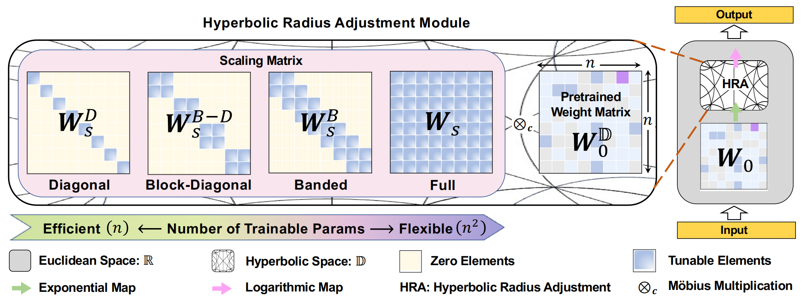

# HyperET
Official code of ''HyperET: Efficient Training in Hyperbolic Space for
Multi-modal Large Language Models''

<p align="left">
<a href="https://arxiv.org/abs/2510.20322" alt="arXiv">
    </a>
</p>

<p align="center">

</p>


## Environment
```shell script
conda create -n HyperET python==3.10
conda activate HyperET
pip install -r requirements.txt
pip install -e .
```
## TODO 
- [x] Implementation of fine-tuning experiments  
- [ ] Implementation of pre-training experiments
- [x] Implementation of simplified hyperbolic radius visualizations  

## Data
- For ScienceQA, please refer to the [official repo](https://github.com/lupantech/ScienceQA).
- For LLaMA weight, please refer to the [official form](https://forms.gle/jk851eBVbX1m5TAv5)  or unofficial HuggingFace repo [LLaMA-7B](https://huggingface.co/nyanko7/LLaMA-7B/tree/main) and [LLaMA-13B](https://huggingface.co/TheBloke/llama-13b).


## Fine-tuning
```shell script
# LLaMA-7B
cd ./Fine-tuning
bash scripts/finetuning_sqa_7b.sh
bash scripts/eval_sqa_7b.sh

# LLaMA-13B
cd ./Fine-tuning
bash scripts/finetuning_sqa_13b.sh
bash scripts/eval_sqa_13b.sh
```

## Visualization
```shell script
# CLIP
cd ./Visualization
python test_clip.py

# DINOv3
cd ./Visualization
python test_DINOv3.py

# SAM
cd ./Visualization
python test_SAM.py
```

## Acknowledgements

- [poincare-embeddings](https://github.com/facebookresearch/poincare-embeddings)
- [LLaVA](https://github.com/haotian-liu/LLaVA)
- [MemVP](https://github.com/JieShibo/MemVP)

## Citation

```
@article{peng2025hyperet,
  title={HyperET: Efficient Training in Hyperbolic Space for Multi-modal Large Language Models},
  author={Peng, Zelin and Xu, Zhengqin and Liu, Qingyang and Yang, Xiaokang and Shen, Wei},
  journal={arXiv preprint arXiv:2510.20322},
  year={2025}
}
```
